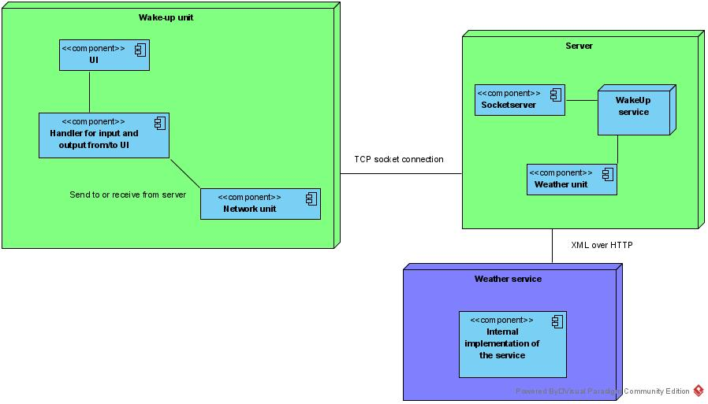
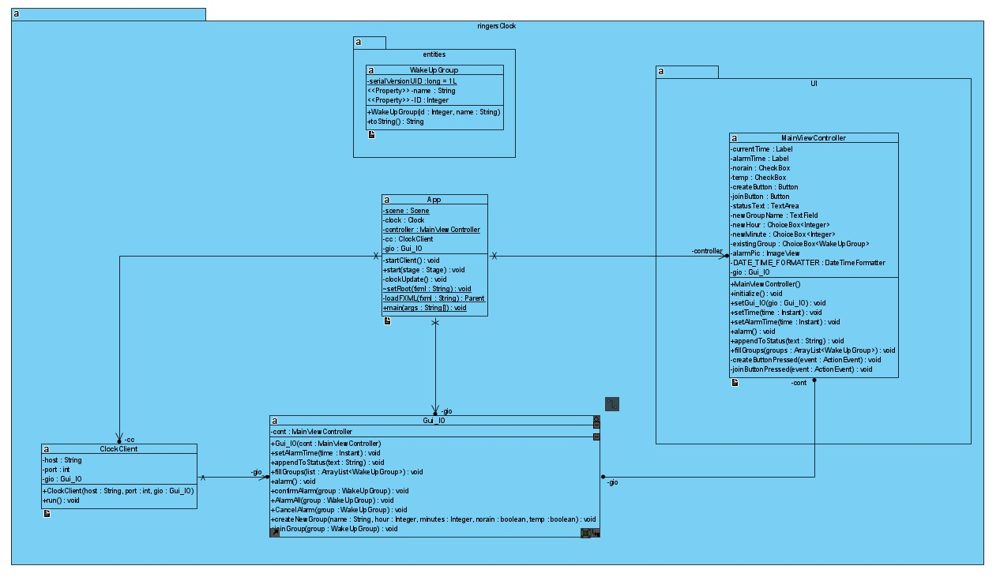
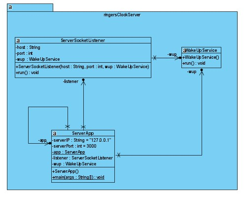
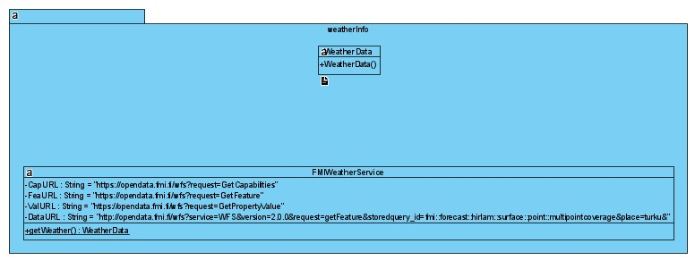

# Hajautetut ohjelmistojärjestelmät ja pilvipalvelut 2020

## Harjoitustyö 2 Rengastajan herätyskello

Kurssin toisessa harjoitustyössä tutustutaan verkkoyhteyksien käyttöön. Samalla syvennetään myös säikeiden käytön osaamista. 

Työn aiheena on herätyspalvelu lintujen tutkijoille - rengastajille. 

### Rengastuksesta

Rengastus on tärkeä apuväline muutontutkimuksessa: sen avulla saadaan tietoa eri lintulajien muuttoreiteistä, niiden käyttämistä levähdys- ja talvehtimisalueista sekä muuttonopeuksista. Muutontutkimuksen lisäksi rengastus on korvaamaton tutkimusmenetelmä monilla muilla lintutieteen osa-alueilla. Rengastuksen avulla saadaan tietoa mm. lintujen iästä, kuolevuudesta ja kuolinsyistä, synnyinpaikka-, kotipaikka- ja puolisouskollisuudesta, vuosittaisista kannanmuutoksista,yksilöiden elinaikaisesta jälkeläistuotosta ja eri ominaisuuksien periytyvyydestä, lintuparven sosiaalisesta arvojärjestyksestä sekä yksilön elinpiirin laajuudesta ja hyväksikäytöstä. Rengastuksen tuottama tieto edistää myös lintujen suojelua. _Lainaus lähteestä: [LUOMUS, Rengastustoimisto](https://www.luomus.fi/fi/lintujen-rengastus#Miksi%20lintuja%20rengastetaan)_

Usein tutkimusprojektien kenttätyöt maastossa tapahtuvat aikaisin aamulla ja ne ovat mahdollisia vain sään ollessa suotuisa. Työtä tehdään usein usean hengen ryhmässä. Ongelmana on tietää illalla, onko seuraavan aamun sää sopiva. 

### Herätyspalvelu rengastajille

Järjestelmä on asiakas-palvelinohjelmisto, joka käyttää avoimen datan palvelua säätilan määrittämiseen. Asiakasohjelma toimii varsinaisena herätyskellona ja sen kautta käyttäjät asettavat herätystiedot. Palvelinohjelma koordinoi herätykset ryhmien sisällä, tarkistaa säätilavaatimuksen ja suorittaa herätyksen.

#### Vaaditut ominaisuudet
- Samanaikaisia käyttäjiä on rajoittamaton määrä
- Samanaikaisesti järjestelmää käyttäviä tutkimusryhmiä rajoittamaton määrä
- Jokaisella ryhmällä on kuitenkin vain yksi johtaja
- Johtajaksi määrätään se, joka luo herätysryhmän järjestelmään
- Herätysaika on vapaavalintainen
- Yksittäinen käyttäjä liittyy yhteen ja vain yhteen ryhmään
- Käyttäjä voi erota ryhmästä, jolloin hänen herätyksensä perutaan
- Jos ryhmän johtaja eroaa, perutaan koko herätys ja luotu ryhmä poistetaan. Ryhmän jäsenten ohjelmat palautetaan alkutilaan.
- Säätila haetaan Ilmatieteenlaitoksen avoimen data palvelusta

#### Oletukset
- Ohjelman yksinkertaistamiseksi oletetaan verkkoliikenne virheettömäksi.
- Herätysaikaa seurataan vain palvelimella ja palvelin käynnistää herätyksen. 
- Säätä koskevia ehtoja on vain kaksi
- Sään seuraamisen yksinkertaistamiseksi oletetaan, että paikkakuntana on aina Turku (tai jokin muu). Se asetetaan kovakoodattuna ohjelmaan.

#### Herätyksen kulku

Ryhmän johtaja tilaa herätyksen luomalla asiakasohjelmassa herätysryhmän. Uudelle ryhmälle asetetaan nimi, herätysaika sekä säätä koskevat vaatimukset. Sen jälkeen ryhmän muut tutkijat liittyvät ryhmään. 

Herätysajan koittaessa palvelin tarkastaa sääehdon täyttymisen:
- Jos ehto ei täyty, perutaan herätys ja herätys nollataan myös asiakasohjelmista. 
- Jos sää on kelvollinen, herätetään vain ja ainoastaan ryhmän johtaja. Hänelle esitetään varmistuskysymys ja vasta hänen hyväksyttyään herätyksen, herätetään muu ryhmä.
Herätyksen jälkeen ohjelma palaa alkutilaansa ja ryhmä poistetaan.

### Ohjelmarungon rakenne

#### Asiakasohjelma

**Pakkaus fi.utu.tech.ringersClock**

Asiakasohjelman runko sisältää seuraavat luokat:
- App
- ClockClient
- Gui_IO

App-luokka on asiakasohjelman käynnistävä luokka, joka käyttää muita luokkia. Ainoastaan sen startClient()-metodiin tulee (mahdollisesti) koskea. Lisäksi luokkaan voi joutua lisäämään luokkamuuttujia.

ClockClient-luokka toteuttaa asiakasohjelman tarvitsemat verkkopalvelut. Se ottaa yhteyden palvelimeen ja kuuntelee palvelimelta saapuvaa liikennettä. Lisäksi palvelimelle tietoa lähettävät metodit rakennetaan tähän luokkaan.

Gui_IO-luokka sisältää metodeita, jotka käsittelevät käyttöliittymän ja verkon kautta saapuvia komentoja. Luokka on erityisen tärkeä harjoitustyön tekemisessä. Osaa sen metodeista joutuu muokkaamaan. Muokattavat metodit ja metodit, joihin ei tule koskea, on merkitty luokkaan. 

**Pakkaus fi.utu.tech.ringersClock.UI**

Tämä pakkaus sisältää ainoastaan JavaFX käyttöliittymän kontrolleriluokan. Tähän luokkaa ei tule tehdä muutoksia.

**Pakkaus fi.utu.tech.ringersClock.entities**

Tässä pakkauksessa on valmiina vain WakeUpGroup-luokka, joka esittää herätysryhmää. Tätä luokkaa käytetään sekä käyttöliittymässä että sitä voi käyttää verkkoliikenteessä. Luokkaa joutuu muokkaamaan. Tähän pakkaukseen on myös mahdollisesti lisättävä omia luokkia.

#### Palvelin

**Pakkaus fi.utu.tech.ringersClockServer**

Palvelinohjelman runko sisältää seuraavat luokat:
- ServerApp
- ServerSockerListener
- WakeUpService

Palvelinohjelman runko on asiakasohjelmaa yksinkertaisempi ja sen luokkarakenteessa on hieman enemmän tekemistä. Palvelimella ei ole graafista käyttöliittymään. ServerApp-luokka on palvelimen käynnistävä luokka. Pääosin se kelpaa sellaisenaan, mutta suunniteltavasta luokkarakenteesta riippuen siihen saattaa tulla pieniä muutoksia: uusia luokkamuuttujia, muutoksia metodien parametreihin tai uusia kutsuja.

ServerSockerListener-luokka on palvelimen verkko-osan ydin. Sen tehtävänä on kuunnella uusia saapuvia asiakkaita. Luokan implementointi on ryhmän vastuulla. 

WakeUpService-luokka hoitaa tilattujen herätysten ja niihin liittyvien ryhmien kirjanpidon. 

Palvelinohjelman toteutukseen tarvitaan lisää uusia luokkia.

#### Sääpalvelu

**Pakkaus fi.utu.tech.weatherInfo**

Sääpalvelu sisältää seuraavat luokat:
 - FMIWeatherService
 - WeatherData

FMIWeatherService-luokkaan toteutaan staattinen metodi, joka hakee Ilmatieteenlaitoksen avoimen data palvelusta sen hetkisen säätilan ja palauttaa tarvittavat tiedot WeatherData-luokan esittämänä oliona.

## Tehtävä 1. Suunnitteludokumentti

Harjoitustyön ensimmäisen vaiheen on tarkoitus auttaa tutustumaan ongelmakenttään ja ohjata oikeaan tapaan toteuttaa ohjelmistoja. Tässä vaiheessa on tarpeellista käydä läpi huolella tehtävän suorittamiseen annettu ohjelma runko. Sen rakenteen ymmärtäminen antaa pohjan järkevälle toteutukselle.
Perusteellinen suunnittelu myös nopeuttaa varsinaista ohjelmointityötä ja vähentää vakavien luokkahierarkian rakenteellisten virheiden mahdollisuutta.

**Luokka- ja sekvenssikaavio ohjelman toiminnasta**

Suunnitteludokumentin tulee sisältää sekä luokka- että sekvenssikaavio. 

Luokkakaavioon kuvataan, mitä luokkia ohjelmassa on ja mitkä niiden tehtävät ovat. Pohjana kaaviossa ovat olemassa olevat luokat ja sitä täydennetään omilla luokille. Luokkien kaikki metodeita ja muuttujia ei tarvitse kattavasti esittää, eikä käyttöliittymään kuuluvaa kontrolleria tarvitse käsitellä lainkaan. Ohjelman toiminnan kannalta tärkeät tallennettavat tiedot (luokkamuuttujat) ja luokan toiminteet (metodit) on listattava.

Sekvenssikaaviossa esitetään, miten ohjelman toiminteiden suoritus etenee. Mitä tehdään, kuka tekee ja mitä viestejä liikkuu ovat tärkeitä asioita selvittää. Esimerkiksi jos käyttäjä lisää uuden herätyksen, miten suoritus etenee? Entä mitä tapahtuu, kun herätysaika koittaa? Sekvenssikaaviossa toimijat on syytä esittää luokkatasolla.

## Tehtävä 2. Ohjelman toteutus

Ohjelma rakennetaan valmiiseen projektipohjaan, jossa asiakasohjelman käyttöliittymä on tehty valmiiksi. Myös palvelinohjelman runko on tehty valmiiksi. Säädatan hakemista varten FMIWeatherService-luokassa on valmiina osoitteita, joita voi käyttää.

Lisätietoa Ilmatieteen laitoksen avoimen datan palveluista löytyy sivustosta:

*[Ilmatieteenlaitos avoin data](https://www.ilmatieteenlaitos.fi/avoin-data)*

